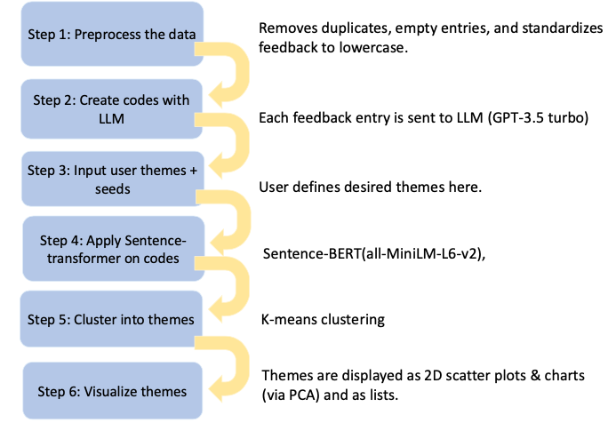

# Thematic: An AI-based web-app for thematic analysis

The goal of this app is to help educators analyze qualitative data by automating thematic analysis with LLMs.

## Target Users
- Educational Researchers
- Professors & Instructors
- Academic Support Teams


## Tech Stack & Tools

- **Frontend:**  
  - [React](https://react.dev/) – UI library for building interactive interfaces  
  - [Bootstrap](https://getbootstrap.com/) – CSS framework for responsive design  

- **Backend:**  
  - [Flask](https://flask.palletsprojects.com/) – Lightweight Python web framework  
  - [SQLAlchemy](https://www.sqlalchemy.org/) – ORM for database models  
  - [Flask-Migrate](https://flask-migrate.readthedocs.io/) – Database schema migrations  

## Live Demo

**Live Demo:** [https://thematic.onrender.com](https://thematic.onrender.com)


## Backend Architecture
## Backend Architecture

The app follows an AI pipeline where incoming qualitative feedback is processed through the following stages:



## Setup

Follow these steps to run the application on your local machine.


### 1. Clone the Repository

```
git clone https://github.com/pyEdTools/thematic.git
cd thematic
```
---

### 2. Prerequisites

- **Python 3.9 or 3.10**  
  The backend was tested with Python 3.10.
  Python 3.11+ may cause compatibility issues.

- **Node.js (v16 or v18+)**  
  Required for running the React frontend (tested with Node 18).

- **OpenAI API Key**


Set up a virtual environment and install dependencies:

```
python3.10 -m venv .venv 
source .venv/bin/activate  
pip install -r requirements.txt
```
---

### 3. Backend Setup
Create a `.env` file in the `backend` folder:
```
cd backend
SECRET_KEY=dev-secret
OPENAI_API_KEY=your_openai_api_key_here
```
---

### 4. Run Flask Backend
```
python main.py
```
Flask should say: Running on `http://127.0.0.1:5001`
---

### 5. Frontend Setup
Open up a split terminal
```
cd frontend
npm install
npm start
```
React dev server will run on `http://localhost:3000`.
---

### 6. Viewing the Application
- Open http://localhost:3000 to view the frontend.
- The frontend will automatically proxy API calls to the Flask backend running at http://127.0.0.1:5001.

---

# Issues

Create an issue on the GitHub page, or send an email to ahernandez577@ucmerced.edu

